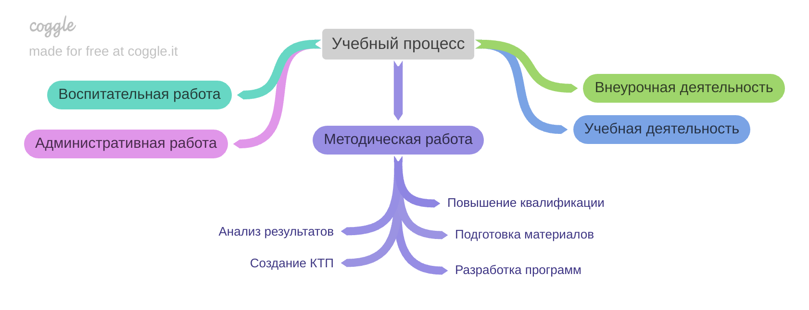
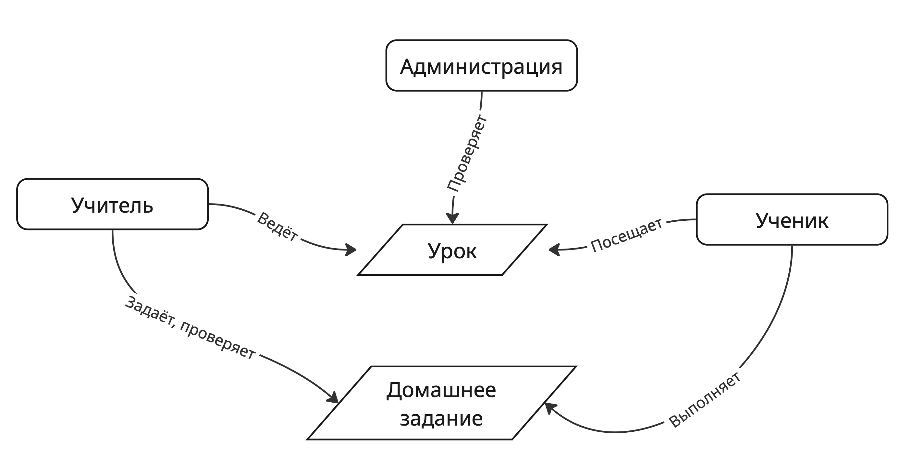
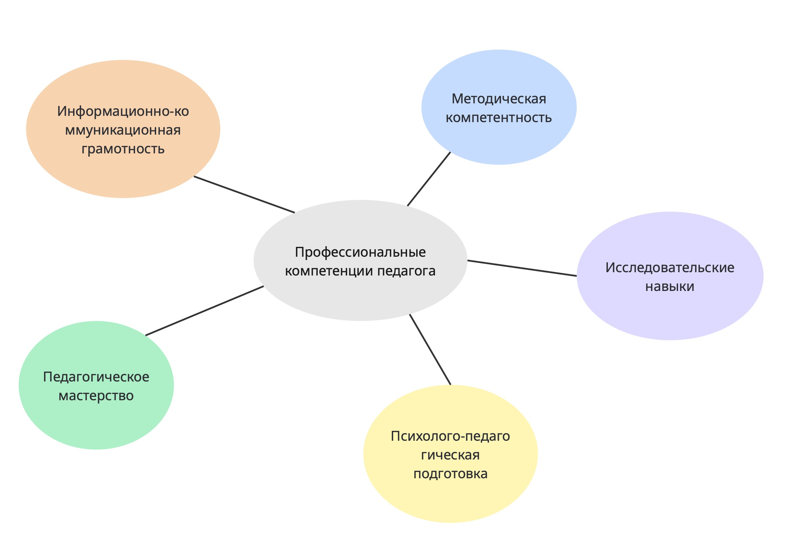
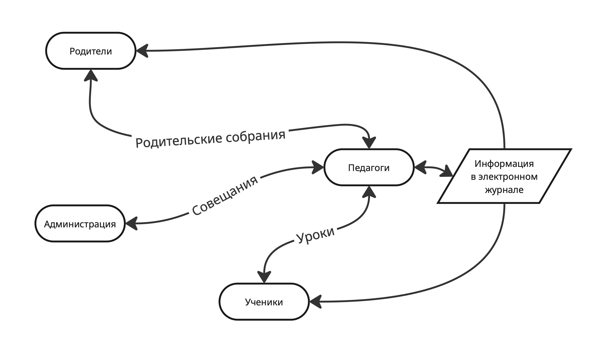

## Задание 3.2. Разработайте четыре типа карт знаний вашей образовательной организации. Для выполнения задания используйте e-learning-решения.

Для создания концептуальных карт были использованы сервисы: [Miro](https://miro.com/) и [coggle](https://coggle.it/)

### Процессно-ориентированная карта знаний

### Концептуальная карта знаний

### Карта компетенций

### Карта социальных сетей

