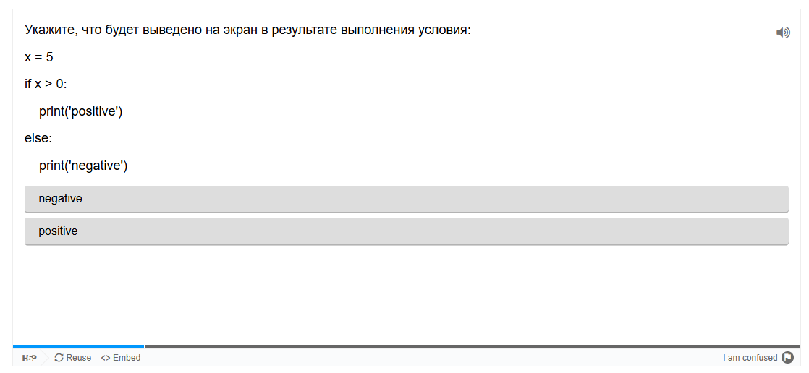

# Разработка методических материалов с использованием H5P

Разработаны материалы, которые могут использоваться на занятиях по программированию на языке Python.

## Справочник для вводного занятия

[https://elearningkmproject.h5p.com/content/1292546476647099207](https://elearningkmproject.h5p.com/content/1292546476647099207)

## Тест по условиям в Python

[https://elearningkmproject.h5p.com/content/1292546469745479777](https://elearningkmproject.h5p.com/content/1292546469745479777)

